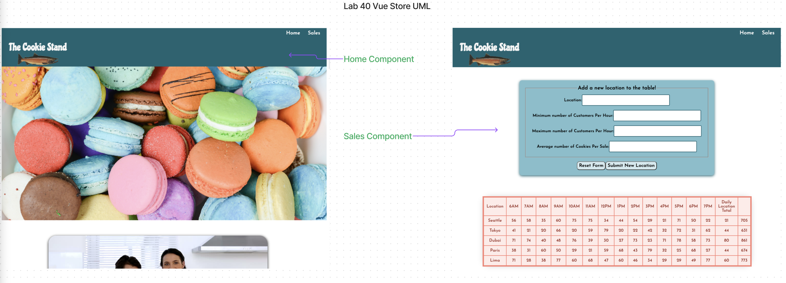
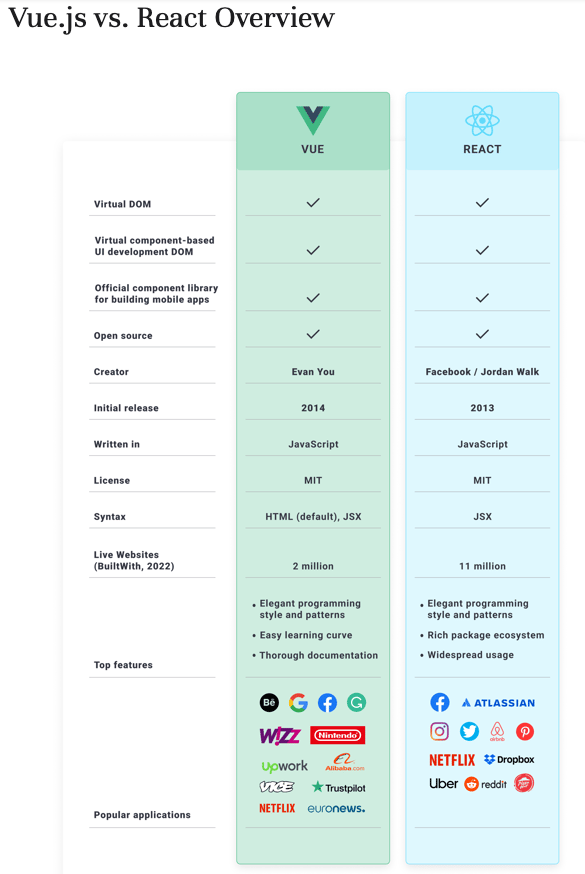
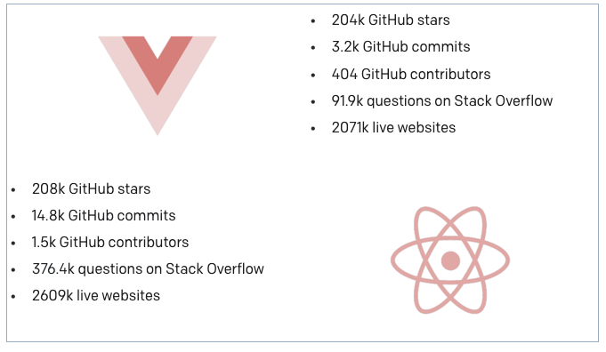
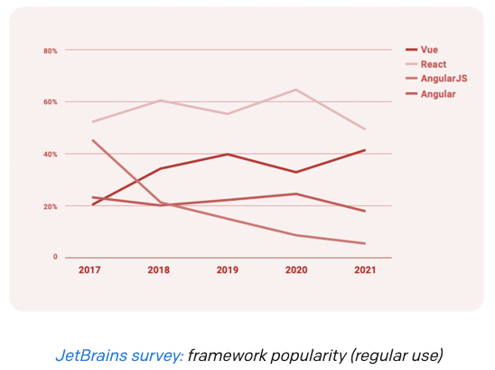

## JS Framework Comparative Analysis

### Vue.js
  


#### Research Conducted By:

* Kati Lee
* Eva Grace Smith

## Collaboration

[Mark Smith - Tutor](https://github.com/markmrsmith)

# vue-store

#### UML
 

### Overall Score and Comments
Score (Out of 10): 8

#### General Comments


"In 2014, a lone developer, Evan You, built and released Vue.js, an open-sourced frontend framework in order to improve on available JavaScript tools. A former Google employee, he wanted to create a framework that combined the best approaches to frontend development from frameworks like Angular, Ember, and React with other features that made writing web apps faster, easier, and more pleasant.

* **Virtual DOM** —instead of re-rendering the whole page as is the case with regular DOM, React and Vue update only those objects that have changed, saving time and resources that heavy DOM manipulations otherwise consume.
* **Component-based UI development** — Vue’s and React’s considerable libraries of components facilitate code reuse, improve developer productivity, and speed up the development process.
* **Focus on the view library** — separate concerns for routing, state management, etc.
* **Usage of JavaScript** — both frameworks rely partially on JS which also means that developers that know this technology can easily learn both React and Vue.""

[Comparing Vue and React in 2023: Pros and Cons](https://dev.to/ptheodosiou/comparing-vue-and-react-in-2023-pros-and-cons-10nl#:~:text=Vue%20and%20React%20are%20still%20popular%20web%20development%20frameworks%20in,personal%20experience%20with%20the%20frameworks.)

### Pros

* **Easy to Learn and Use:** Vue offers a smooth learning curve that makes it suitable for both novice and professional developers.

* **High Performance:** Vue's virtual DOM and efficient rendering result in speedy and performant apps.

* **Flexible and Incremental Adoption:** Vue enables progressive adoption in existing projects, making it adaptable to a variety of use cases.

* **Composition API:** Vue's Composition API allows you to handle state and logic in components in a modular and flexible manner, enhancing code organization and maintainability.

* **Strong Ecosystem:** Vue has a growing ecosystem of libraries, tools, and plugins that are backed up by excellent documentation and a welcoming community.

### Cons

* **Smaller Community:** Vue's community is still smaller than React's, making it more difficult to find extensive resources and support.

* **Limited Enterprise Adoption:** When compared to React, which has a longer history and established presence in the enterprise space, Vue may have limited adoption in large-scale enterprise applications.

## Ratings and Reviews

[Vue vs. React in 2023 - Comparison of Two Most Popular JS Frameworks](https://www.monterail.com/blog/vue-vs-react#:~:text=The%20share%20of%20Vue.,49%25%20in%20a%20YoY%20comparison.&text=Another%20statistic%20giving%20us%20a,yearly%20State%20of%20JS%20survey.)

### 

### Community Support and Adoption levels

[Comparing Vue and React in 2023: Pros and Cons](https://dev.to/ptheodosiou/comparing-vue-and-react-in-2023-pros-and-cons-10nl#:~:text=Vue%20and%20React%20are%20still%20popular%20web%20development%20frameworks%20in,personal%20experience%20with%20the%20frameworks.)

### Popularity
### 

### Usage among developers

The share of Vue.js users grew from 34% in 2020 to 43% in 2021 while React experienced a drop from 64% to 49% in a YoY comparison.
### 


### Documentation
"Since Vue has a very active community, there’s a plethora of well-maintained and organized documentation. This makes it easier to learn and find solutions to issues you could encounter. Actually, 76% of Vue survey participants pointed to great documentation as the biggest advantage of the framework. The overhauled documentation has been one of the core updates in Vue 3."


# Systems Requirements

* By default, Vue uses HTML templates, but there’s an option to write in JSX.

"Vue is lightweight, easy to learn, pleasant to write in, and not difficult to integrate with legacy technologies or an application without a specified framework.  Because of its familiar templating syntax and use of components, integrating or migrating existing projects to Vue is faster and smoother. For that reason, Vue.js is great for startups but can be just as well used in large-scale applications."


### Customize configuration
See [Configuration Reference](https://cli.vuejs.org/config/).

### Ramp-Up Projections

How long would/should it take a team of mid-junior developers to become productive?

We found Vue to be fairly easy to implement and learn. It would take a few weeks or months to be productive depending on the size of the project. 

### Links and Resources


[Vue Documentation](https://vuejs.org/guide/introduction.html)

### Examples/Tutorials:

[Tutorial](https://vuejs.org/tutorial/#step-1)

[Quick Start](https://vuejs.org/guide/quick-start.html)

[Playground](https://vuejs.org/examples/#hello-world)

#### Code Demos:
[vue-store](https://voluble-malabi-e8f16e.netlify.app/#/sales)

[vue-store repository](https://github.com/EvaGraceSmith/vue-store)

# Operating Instructions
## Project setup
```
npm install
```

### Compiles and hot-reloads for development
```
npm run serve
```

### Compiles and minifies for production
```
npm run build
```

### Lints and fixes files
```
npm run lint
```

Endpoint: /#/ Returns the home page.

Endpoint: /#/sales/ Returns the sales page and data.
